# Navigation of the Blogspot :-

### Website without login :-
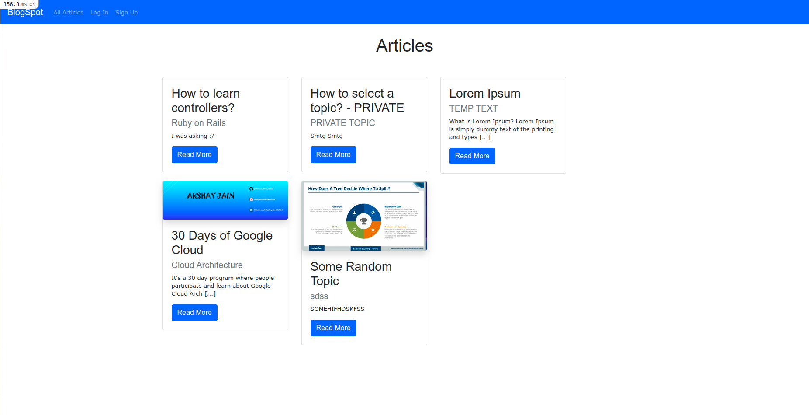

### Trying to access Private Articles without login :-
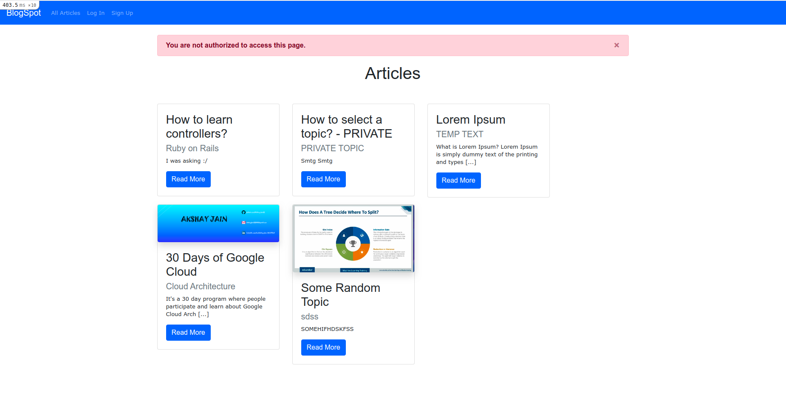

### Though you can access Public Articles without login :-
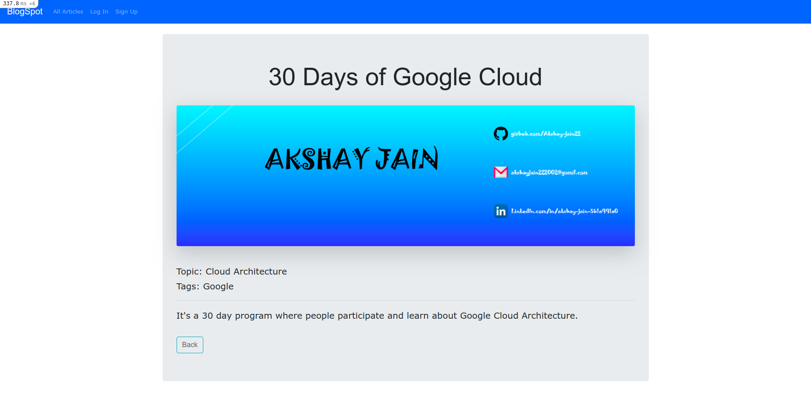

### You can create a account using Sign Up link in navbar :-
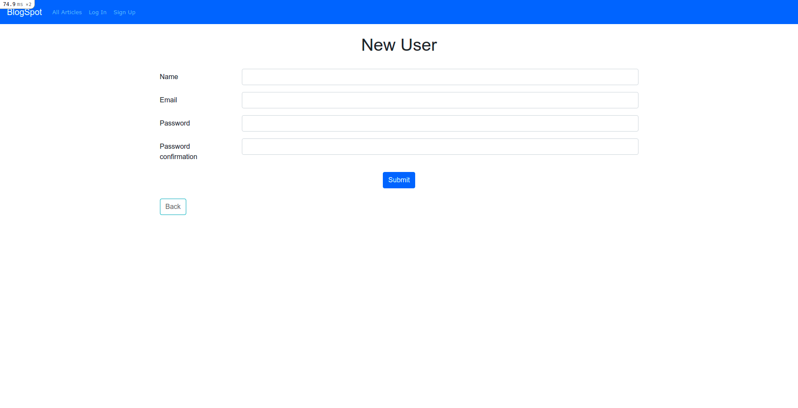

### But as I have already a account I'll go for login :-
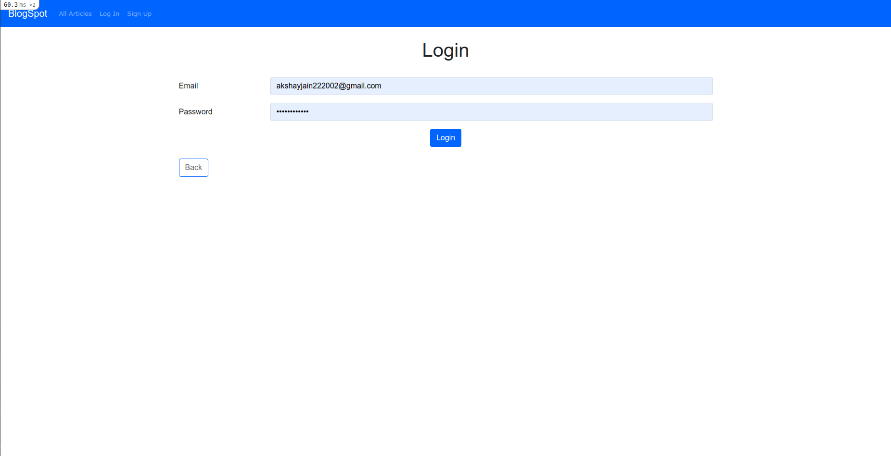

### Website after login, don't forget to observe that navbar got some changes :-
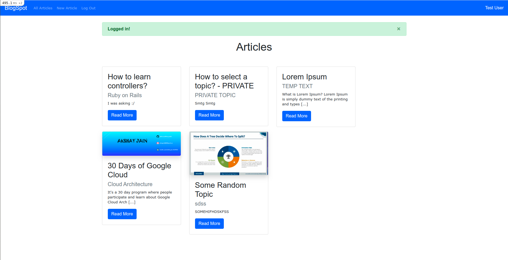

### Now, you can access Private Articles :-
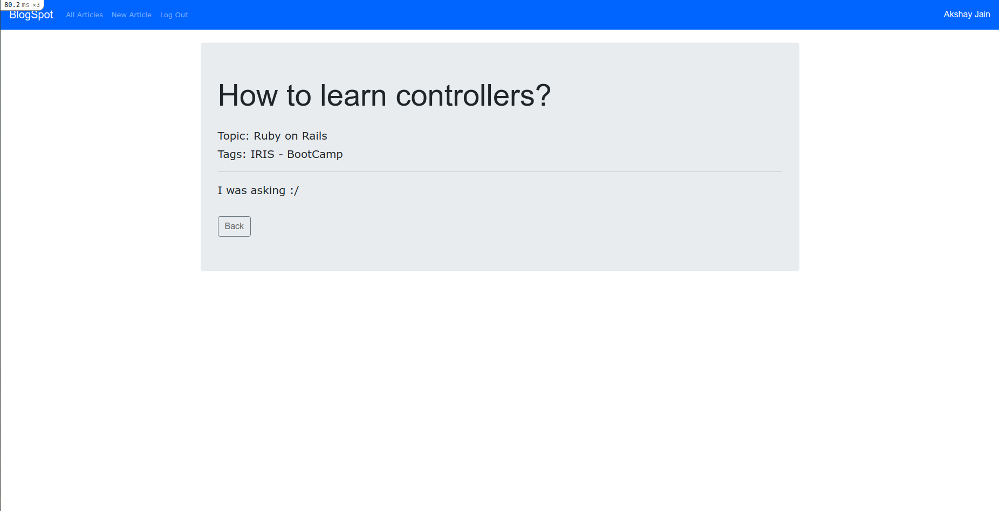

### But not after the limit of 5 :-
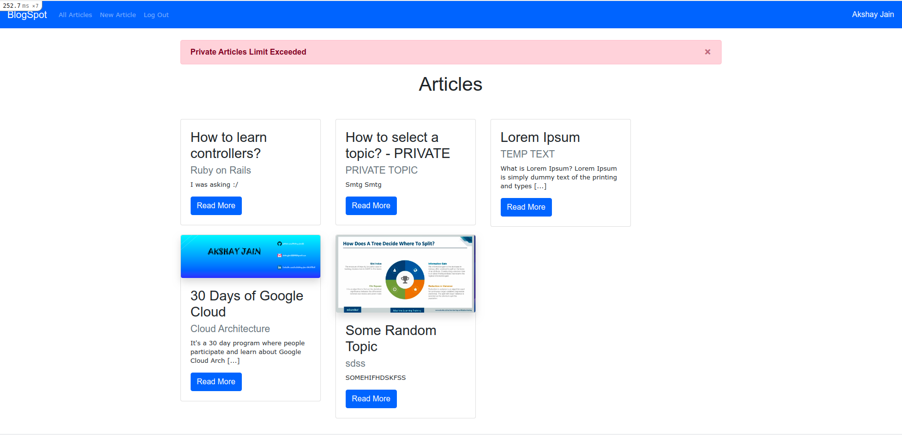

### Better create a Article of yours using 'New Article' link in navbar :-
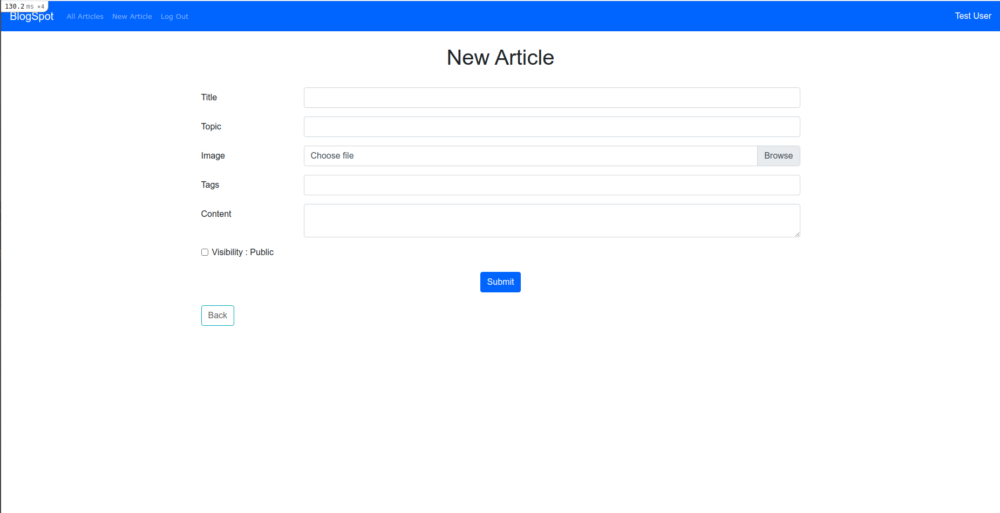

### You can manage(Edit, Delete) your articles :-
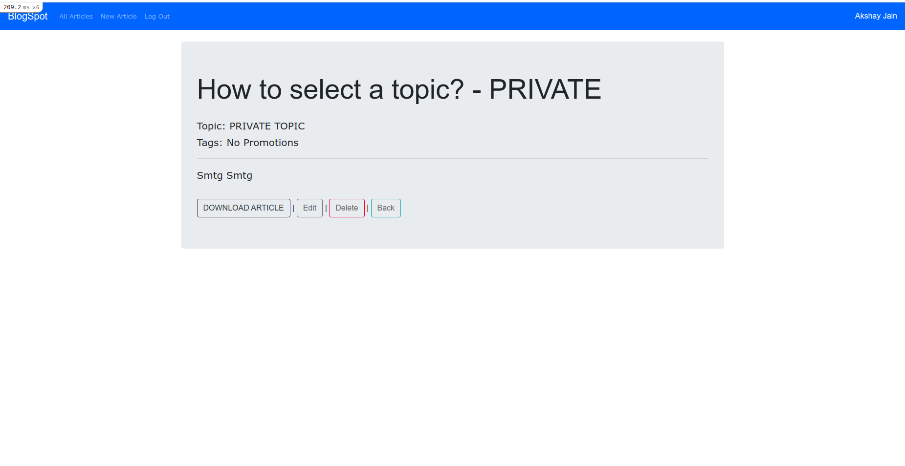

### See, I told u, You can edit your Article :-
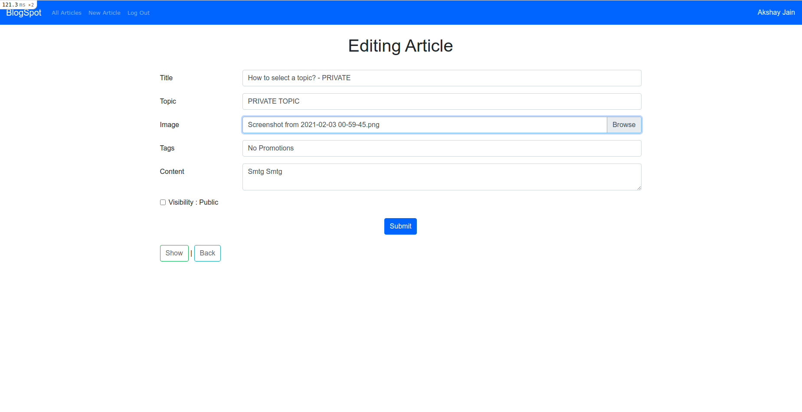

### Take a look at your profile by Your Username link in navabar :-
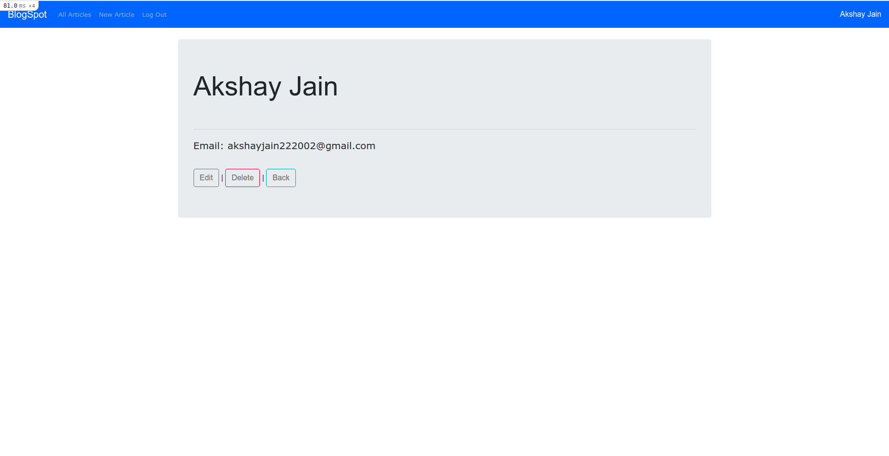

### Or view the Profiles of other users also :-
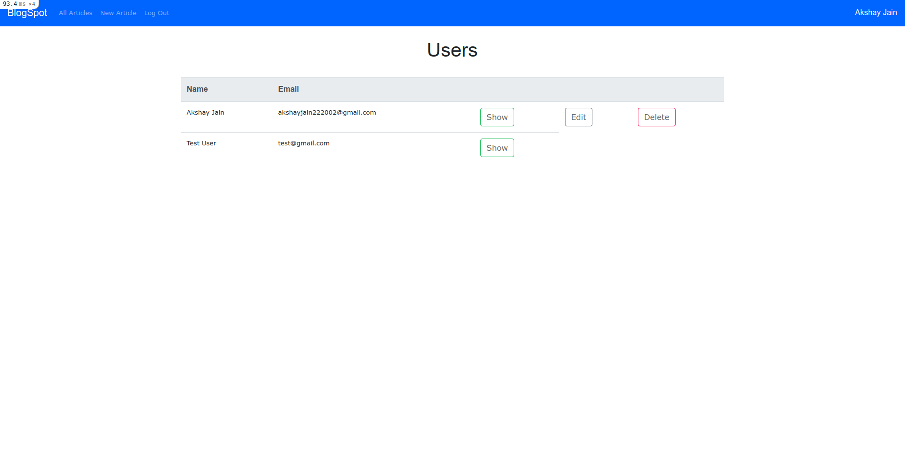

### Are you an ADMIN?, look what it got for U :-
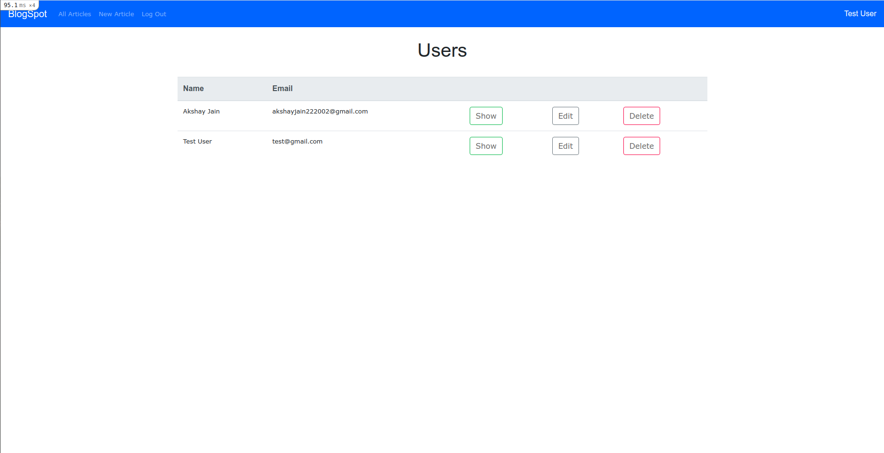

### Don't forget to logout after you're done :-

### Now, you can download the articles and also upload cover images for them
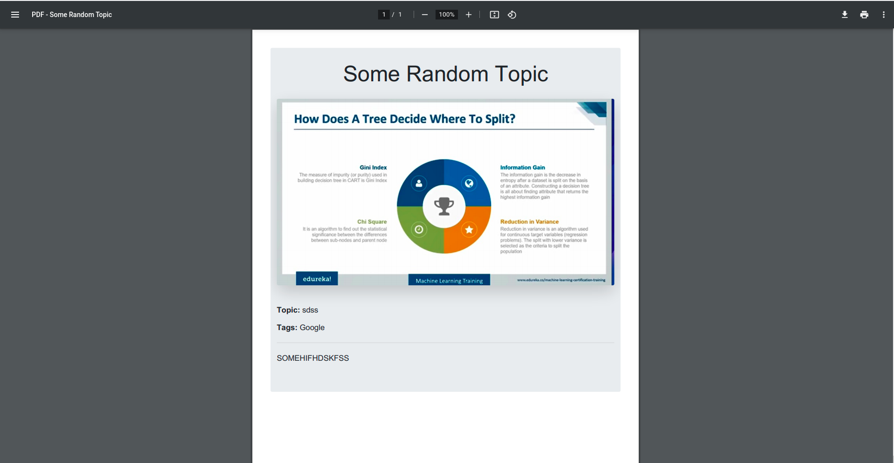
